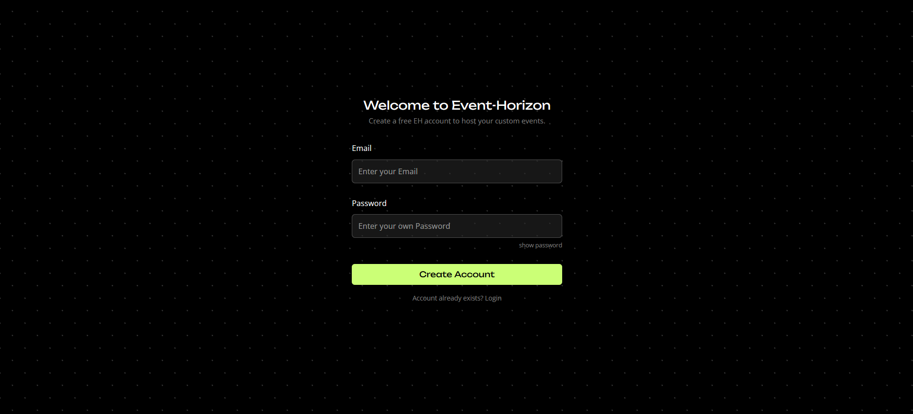
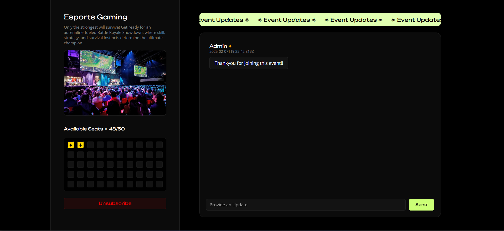
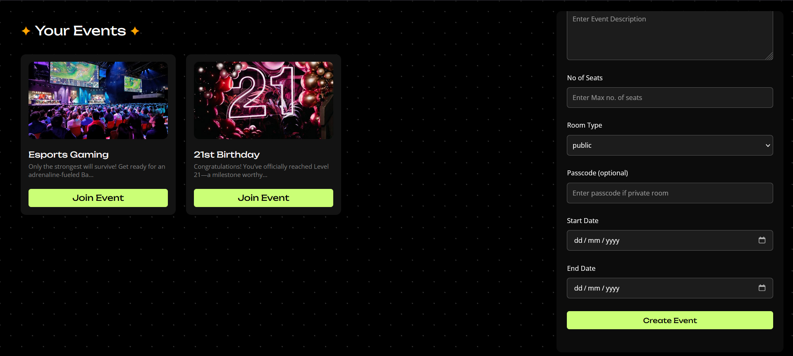

# 🎉 Event Management Platform  

A full-stack event management platform built using the **MERN stack** with **Socket.io** for real-time updates. This application allows users to create, manage, and attend events seamlessly.  

- Frontend Url: https://eventhorizon-x.vercel.app/
- Backend Endpoint: https://event-manager-73so.onrender.com

#### Api End-Points
- /auth 
    - (POST) **/signin**
    - (POST) **/signup**

- /events
    - (GET) **/create**
    - (POST) **/join/:eventId**
    - (PATCH) **/exit/:eventId**
    - (DELETE) **/:eventId**
    - (GET) **/**
    - (GET) **/get/:eventId**
    - (GET) **/admin**


#### Installed dependencies
- Express
- Mongoose
- Cors
- Socket.io
- Bcryptjs
- Jsonwebtoken
- Multer
- Multer-storage-cloudinary
- Cloudinary


#### Dev dependencies
- Nodemon
- Dotenv

## 🚀 Features  

#### ✅ User Authentication  
- Secure **user registration and login**.  
- **Guest login** with limited access.  
- Passwords are **hashed** using `bcryptjs`.  
- Emails are **tokenized** for security.  

#### ✅ Event Management  
- **Create, update, and delete** events.  
- Events include **name, description, date, banner, and other details**.  
- **Event visibility**: Events can be **public or private**.  
- **Passcode protection** for private events.  

#### ✅ Real-Time Updates  
- Implemented **Socket.io** for instant updates.  
- Users receive **real-time notifications** about event changes.  
- **Live attendee count** updates dynamically.  

#### ✅ Seat Booking System  
- Each event has a **maximum slot size**.  
- Users can **occupy seats** by joining events.  

#### ✅ Responsive UI/UX  
- **Multi-platform responsive UI** for desktop, tablet, and mobile.  

#### ✅ Future Enhancements  
- **Event ticketing system** (coming soon).  
- **Advanced admin controls** for event management.  

## 🛠️ Tech Stack  
- **Frontend:** React.js 
- **Backend:** Node.js, Express.js  
- **Database:** MongoDB Atlas  
- **Real-Time:** Socket.io  
- **Hosting:**  
  - **Frontend:** Vercel  
  - **Backend:** Render  
  - **Database:** MongoDB Atlas  
  - **Image Hosting:** Cloudinary  

## 📂 Database Schemas  

#### 1️⃣ User Schema  
```js
const UserSchema = new mongoose.Schema({
  email: { type: String, required: true, unique: true },
  password: { type: String, required: true }
});
```
- Password Hashing: Uses bcryptjs for security.
- Email Tokenization: Ensures privacy.
#### 2️⃣ Event Schema
```js
const EventSchema = new mongoose.Schema({
  name: { type: String, required: true },
  uid: { type: String, required: true },
  description: { type: String, required: true },
  bookedSlots: [{ type: mongoose.Schema.Types.ObjectId, ref: "Users" }],
  maxSlotSize: { type: Number, required: true },
  roomType: { type: String, enum: ["private", "public"], default: "public" },
  passcode: { type: String },
  startDate: { type: Date, required: true },
  endDate: { type: Date, required: true },
  banner: { type: String, required: true }
});
```
- Public & Private Events: Users can choose between public and private events.
- Booked Slots: Stores references to attendees.
- Passcode Protection: Required for private events.
## 🔧 Deployment
- Frontend: Deployed on Vercel.
- Backend: Hosted on Render.
- Database: MongoDB Atlas.
- Images: Stored in Cloudinary.

## 🧪 Test Credentials
- Email: test@test.com  
- Password: test123  

## 📌 How to Run Locally

#### 1. Clone the repository:
- git clone https://github.com/your-username/event-management-platform.git
- cd event-management-platform

#### 2. Install dependencies:
- npm install

#### 2. Setup Env File (Backend):
- DB_URL
- JWT_SALT
- CLOUDINARY_SECRET
- CLOUDINARY_API
- CLOUDINARY_TEAM

#### 4. Start the development server:
- npm start
- npm run test (to run development server)

## Screenshots


